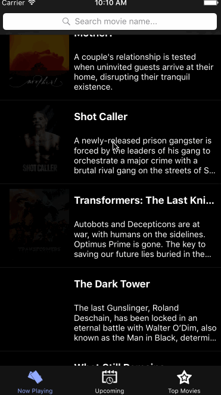

# Flicks-Codepath
### User can view a list of movies currently playing in theaters from The Movie Database.

Time spent: 26 hrs spent

Completed User Stories:
- User can view a list of movies currently playing in theaters from The Movie Database.
- User can view movie details by tapping on a cell.
- User sees loading state while data being loaded.
- User sees an error message when there's no internet.
- Added a tab bar for Now Playing, Upcoming & Top Rated movies.
- All images fade in as they are loading
- Customizing the highlight and selection effect of the cell
- Customize the navigation bar
- Movies details will show avg ratings & release date.

Walkthrough of all user stories:

GIF created with [LiceCap](http://www.cockos.com/licecap/).
